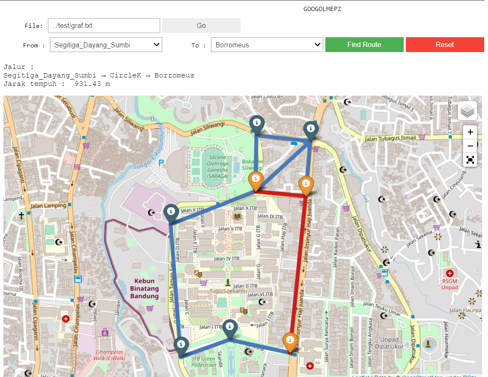

# ThreeChill GOOGOLMEPZ
> Sebuah program untuk melakukan path finding menggunakan algoritma A*. Untuk mengetahui mengenai A* Algorithm dapat membuka tautan [ini](https://www.geeksforgeeks.org/a-search-algorithm/)

## Daftar Isi
- [ThreeChill GOOGOLMEPZ](#threechill-googolmepz)
  * [Screenshots](#screenshots)
  * [Setup/Instalasi](#setup-instalasi)
  * [Cara menjalankan program](#cara-menjalankan-program)
  * [Format file masukan](#format-file-masukan)
  * [Author](#author)

<small><i><a href='http://ecotrust-canada.github.io/markdown-toc/'>Table of contents generated with markdown-toc</a></i></small>

## Screenshots

## Setup/Instalasi
- Disarankan menggunakan visual studio code
- Python terinstall, teruji pada python 3.8x atau setelahnya
- Memiliki extension jupyter pada vs code atau menggunakan jupyter notebook lain
Pada terminal, jalankan perintah berikut :
- Menginstall `folium` dan `ipywidget`, dapat dilakukan menggunakan pip
- `pip install folium`
- `pip install ipywidgets`
- `jupyter nbextension enable --py widgetsnbextension`

## Cara menjalankan program
- Pada folder `src`, buka file `Stima.ipynb` pada visual studio code
- Pastikan device terhubung ke jaringan internet, untuk dapat menampilkan visualisasi peta
- `Run all` pada notebook
- Input nama file path relative

## Format file masukan
- Berekstensi `.txt`
- Baris pertama berisi jumlah simpul
- Baris selanjutnya, diisi oleh `namasimpul longitude latitude` sejumlah banyaknya simpul
- Selanjutnya diisi oleh matriks ketetanggaan antar simpul
- Contoh masukan dapat dilihat pada folder test

## Author
[@rayendito](https://github.com/rayendito) - 13519157\
[@mhmmdjafarg](https://github.com/mhmmdjafarg) - 13519197

